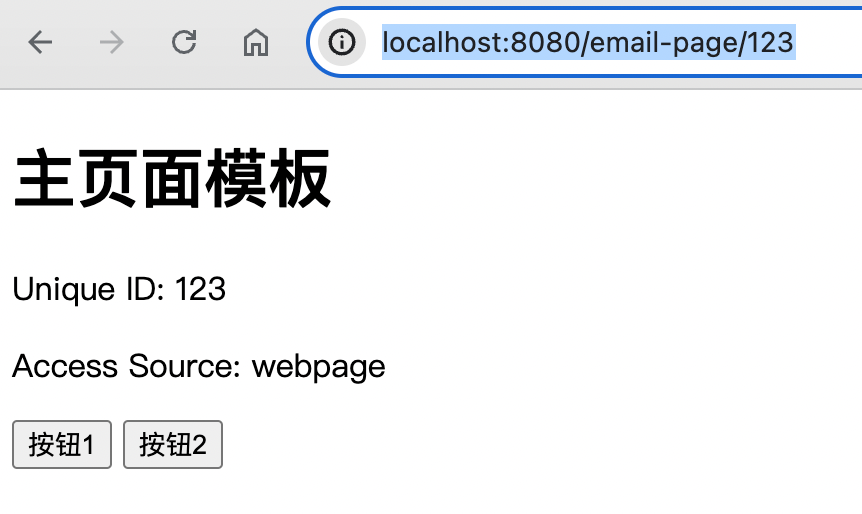
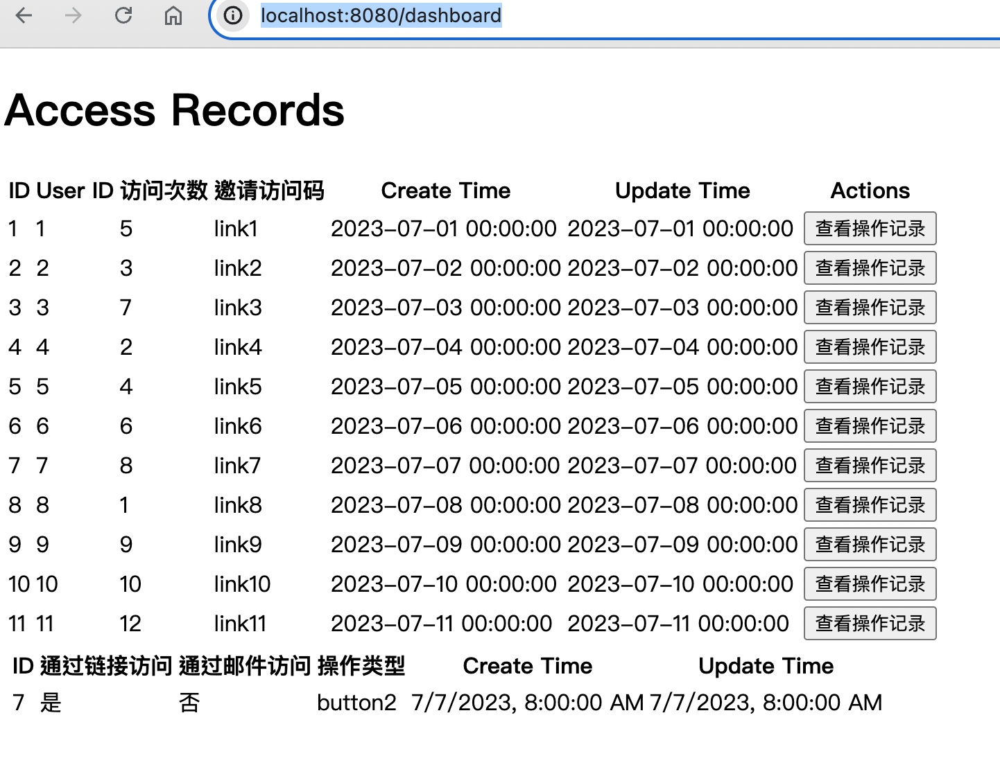
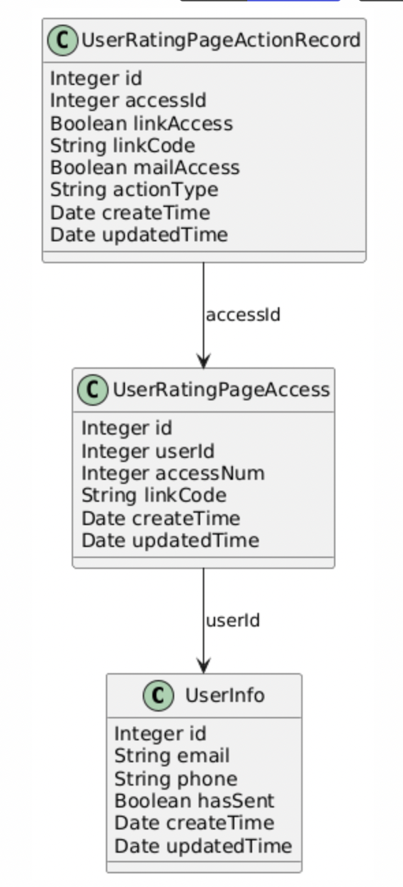

项目简介

# 功能介绍：
## 系统主要包含两个页面

此页面可以直接访问，也有邮件会直接发送此模版，收到邮件所渲染出来的页面与此页面一致
http://localhost:8080/email-page/123

此页面是dashboard页面，主要记录了上面的页面访问记录，包括了页面的访问情况，页面中按钮的点击情况
http://localhost:8080/dashboard

## 系统定时任务
系统初始化了一些用户信息

1. 定时发邮件或短信
2. 定时判断用户是否访问了发出去的链接，若没有访问，则把用户推到发送消息的定时任务中去

# 系统启动流程
1. 打开IDE，运行 com.finpoints.framework.ratetrack.RateTrackApplication.main
2. 在项目目录下 mvn clean package -Dmaven.test.skip=true打包，在target目录下，找到[rateTrack-0.0.1-SNAPSHOT.jar]文件，在文件目录下执行Java -jar rateTrack-0.0.1-SNAPSHOT.jar命令启动项目
## 启动后验证
分别访问页面：
http://localhost:8080/dashboard
http://localhost:8080/email-page/123

# 系统技术架构介绍
- 系统基于springboot来实现
- 前端页面通过 thymeleaf 模版引擎来加载
- 数据采用H2内存数据库来保存
- ORM框架采用的spring data JPA

实体对象UML类图关系如下

# 扩展问题思考
1. 如何确保数据真实性
> 对于不是邮件页面或者短信中的链接，我们可以正常访问页面，但是不会增加访问记录。
> 
> 只有通过邮箱访问的页面或者访问通过短信收到的链接，才会被正常记录下来
> 
> 因为在定时任务中会生成UUID，这个UUID会作为用户访问的标识，在更新用户的访问记录数据时，会依赖这个uuid，携带了有效的uuid的访问链接数据才会被记录
> 
> 不过此系统有这样的问题，用户拿着有效的访问链接，不断刷新的话，会在dashboard页面看到访问次数在增加，这是一个遗漏未处理的问题（可以通过header中的user-agent去重，但是暂时没处理）。
> 
> 用户的点击行为也类似，如果一个有效的链接对应的页面下，多次点击按钮，相关的数据也会增加（相关的拦截限制暂时没处理）
> 
> 总结：数据真实性，我们是通过用户的访问方式来判断的
> - 如果是邮箱中打开的页面；我们直接认为这个页面是有效的页面
> - 如果是打开短信收到的链接，我们认为是有效的链接
> - 用户随意进入页面以及执行点击按钮的行为，均不会记录相关数据
> - 遗漏问题：在有效页面下，未对数据做去重和多次调用的拦截

2. 如果我们只想知道一个e-mail的收件人打开过一次，之后就不算了那怎么做？
> 系统有两个定时任务
> - 任务1，向未发送过邮箱或短信的用户，发送邮箱或短信
> - 任务2，对未访问过邮箱或短信链接的用户，修改其状态为未发送
> 这两个定时任务可以保证
> - 1. 没有打开过邮箱或者没访问过短信链接的用户，会多次发送消息
> - 2. 访问过邮箱或者短信链接的用户，不会再向其发送消息

3. 同一个邮箱打开多次和打开过的邮箱这样的话你会怎么处理
> 邮箱打开页面之后，会在页面加载渲染之前就调用【api/track-visit】接口，在user_rating_page_access表里面access_num字段更新访问次数（+1）操作

